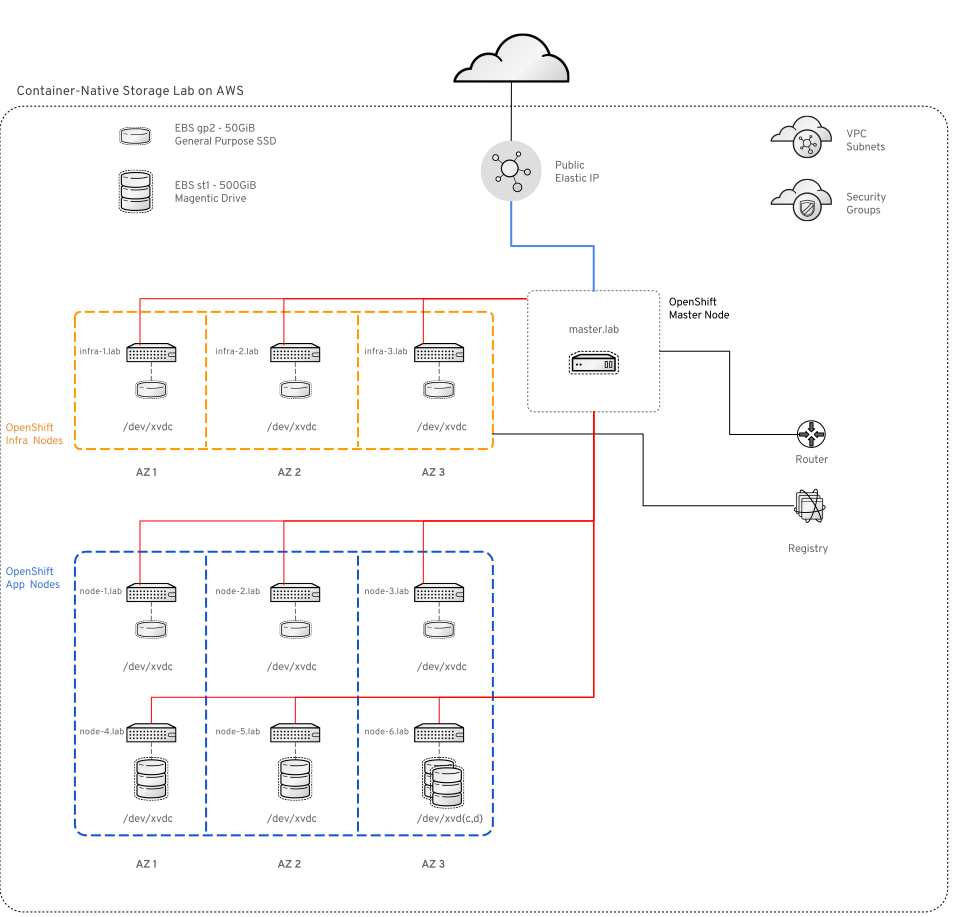

# Welcome to Container-Native Storage Hands-on Lab

This lab guide is designed for self-paced walk-through of the "Container-Native Storage on OpenShift 3.5" hosted on [redhat.qwkilab.com](https://redhat.qwiklab.com). This lab gives you access to a fully functional OpenShift Container Platform 3.5 environment hosted on AWS.

#### Pre-requisites

For this lab you need to fulfill the following pre-requisites:

- Workstation with Internet access

- SSH client supporting authentication with a private key

---

#### Get Lab Access Credentials

Your lab should be pre-provisioned. If that's for some reason not the case you'll see this progress bar:

If you don't see that your lab infrastructure is ready. When this is the case you will see buttons on the right.

In order to access the lab infrastructure click the &nbsp;&nbsp;Connect&nbsp;&nbsp; button and the &nbsp;&nbsp;Addl. Info&nbsp;&nbsp; (will be visible when the lab is readily provisioned) on the right side of the screen to obtain the following access information:

|Type | Name | |
|------------| -------- |-------- |
|SSH Key  | PEM File | *download this file by clicking <kbd>Download PEM/PPK</kbb>* in the "Connect" pane|
|URL to OpenShift UI| OpenShiftLoginURL |e.g. *https://34.226.81.9.nip.io:8443/* |
|IP to Lab Environment | MasterNodePublicIP |e.g. *34.226.81.9* |

The lab has a number of user account definitions

|Type | Username | Password | notes |
|------------| -------- |-------- |-------- |
|Linux user on Master node  | ec2-user | *authenticated via SSH by PEM file*| passwordless sudo access on all systems |
|OpenShift Admin-persona User | operator | `r3dh4t` | will get cluster-admin privileges in the lab |
|OpenShift Developer-persona User | developer | `r3dh4t` | no special permissions |

---

#### Access the Lab environment

The lab will provision a readily installed OpenShift environment.

You access the lab environment in two ways:

- via the web-based UI using your browser pointing to the *OpenShiftLoginURL* using either of the two OpenShift users defined above

- via SSH to the Master node with the *MasterNodePublicIP* using the `ec2-user` and the PEM file

&#8680; To login via SSH download the PEM file to your machine and change the permissions:

    chmod 0400 ~/Downloads/<pem-file-name>

&#8680; Then login with the ssh client like this

    ssh -i ~/Downloads/<pem-file-name> -l ec2-user <MasterNodePublicIP>

The Master node also functions as your *jumpserver*. Once you are logged in to it you have access to all systems with the ec2-user who has passwordless authentication and passwordless sudo capabilities set up.

---

#### Lab Environment IP addresses

The lab environment has 7 nodes in total with stable IP addresses and `/etc/hosts`-based DNS resolution. All nodes have internet access. Only the Master can be reached from the Internet however.

|Host | FQDN | IP address |
|------------| -------- |-------- |
|OpenShift Master| master.lab | 10.0.1.100 |
|OpenShift App Node 1| node-1.lab | 10.0.2.101 |
|OpenShift App Node 2| node-2.lab | 10.0.3.102 |
|OpenShift App Node 3| node-3.lab | 10.0.4.103 |
|OpenShift App Node 4| node-4.lab | 10.0.2.104 |
|OpenShift App Node 5| node-5.lab | 10.0.3.105 |
|OpenShift App Node 6| node-6.lab | 10.0.4.106 |

This lab topology roughly looks like this:

---

#### Get Started

Once you are on the Master node you are ready to start the lab with Module 1.

You might these hints useful:

- many of the commands/files don't contain environment-specific content, there is a <kbd>copy-to-clipboard</kbd> button on the right end of every code block for your convenience
- keep a text editor open to store some outputs that are specific to your environment like the URL and public IP of the Master
- this lab uses nip.io for DNS resolution of the public IP specific to your lab, keep that in mind when working with URLs in the lab
- if you want to look at this lab guide in a separate window: this documentation is hosted at <a href="https://dmesser.github.io/cns-lab-sa-summit/" target="_blank">https://dmesser.github.io/cns-lab-sa-summit/</a>
