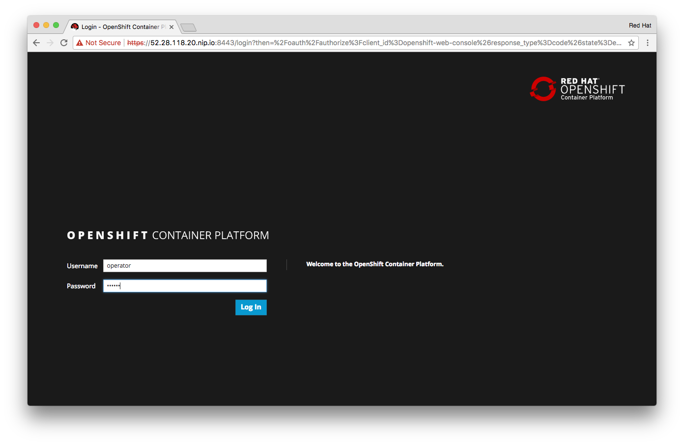
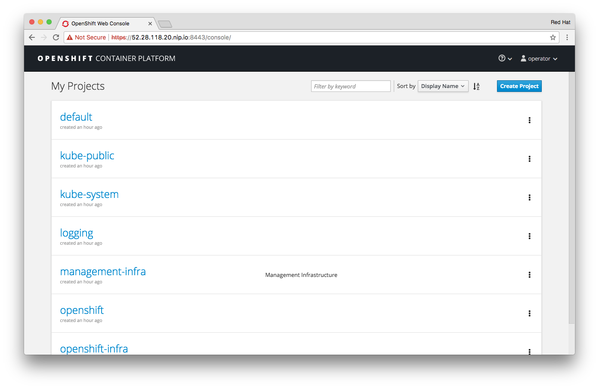

!!! Summary "Overview"
    This module introduces you to the pre-installed OpenShift Container Platform environment in it's default state. No Container-Native Storage components are in place. You may refer back to this chapter for a before-after comparison after completing Module 2 and Module 5.
    There are no pre-requisites for this module.

The OpenShift Lab Environment
-----------------------------

Your lab environment has *OpenShift Container Platform 3.6* pre-installed. It consists of:

 - 1 Master node, running the master services and the router
 - 3 Infra nodes, running the registry
 - 6 App nodes, without any pods

The Master is the only node that's accessible via a public IP. All CLI commands in this lab will be done from this node.

OpenShift has been configured with local authentication, the following users are defined:

|User name | Password | OpenShift privileges |
|------------| -------- |-------- |
|operator| r3dh4t | cluster-admin |
|developer| r3dh4t | regular user |

---

Exploring the Lab configuration
------------------------------------

#### Login via the CLI

In the previous chapter you logged on to the master node as `ec2-user`.

&#8680; From here continue to log on to OpenShift using the `oc` client:

    oc login -u operator

Use `r3dh4t` as the password.

    Authentication required for https://master.lab:8443 (openshift)
    Username: operator
    Password:
    Login successful.

    You don't have any projects. You can try to create a new project, by running

        oc new-project <projectname>

&#8680; Switch to the `default` namespace:

    oc project default

#### Reviewing deployed components

&#8680; Get a general status of the components deployed in this project:

    oc status

You will see that there is a router, an internal container registry and a web-console for that registry deployed:

~~~~
In project default on server https://master.lab:8443

https://docker-registry-default.cloudapps.52.28.118.20.nip.io (passthrough) (svc/docker-registry)
  dc/docker-registry deploys mirror.lab:5555/openshift3/ose-docker-registry:v3.6.173.0.21
    deployment #1 deployed 12 minutes ago - 1 pod

svc/kubernetes - 172.30.0.1 ports 443->8443, 53->8053, 53->8053

https://registry-console-default.cloudapps.52.28.118.20.nip.io (passthrough) (svc/registry-console)
  dc/registry-console deploys mirror.lab:5555/openshift3/registry-console:v3.6
    deployment #1 deployed 10 minutes ago - 1 pod

svc/router - 172.30.131.155 ports 80, 443, 1936
  dc/router deploys mirror.lab:5555/openshift3/ose-haproxy-router:v3.6.173.0.21
    deployment #1 deployed 10 minutes ago - 1 pod
~~~~

&#8680; Display all available nodes in the system

    oc get nodes

You should see 9 nodes in **READY** state:

~~~~
NAME          STATUS                     AGE       VERSION
infra-1.lab   Ready                      14m       v1.6.1+5115d708d7
infra-2.lab   Ready                      14m       v1.6.1+5115d708d7
infra-3.lab   Ready                      14m       v1.6.1+5115d708d7
master.lab    Ready,SchedulingDisabled   19m       v1.6.1+5115d708d7
node-1.lab    Ready                      14m       v1.6.1+5115d708d7
node-2.lab    Ready                      14m       v1.6.1+5115d708d7
node-3.lab    Ready                      14m       v1.6.1+5115d708d7
node-4.lab    Ready                      14m       v1.6.1+5115d708d7
node-5.lab    Ready                      14m       v1.6.1+5115d708d7
node-6.lab    Ready                      14m       v1.6.1+5115d708d7
~~~~

&#8680; A slight variant of that command will show us some tags (called *labels*):

    oc get nodes --show-labels

You should see that 3 node have the label `role=infra` applied whereas the other 6 have `role=apps` set. The master node has scheduling disabled so it is not burdened with additional workloads.

~~~~
NAME          STATUS                     AGE       VERSION             LABELS
infra-1.lab   Ready                      21m       v1.6.1+5115d708d7   beta.kubernetes.io/arch=amd64,beta.kubernetes.io/os=linux,kubernetes.io/hostname=infra-1.lab,role=infra
infra-2.lab   Ready                      21m       v1.6.1+5115d708d7   beta.kubernetes.io/arch=amd64,beta.kubernetes.io/os=linux,kubernetes.io/hostname=infra-2.lab,role=infra
infra-3.lab   Ready                      21m       v1.6.1+5115d708d7   beta.kubernetes.io/arch=amd64,beta.kubernetes.io/os=linux,kubernetes.io/hostname=infra-3.lab,role=infra
master.lab    Ready,SchedulingDisabled   26m       v1.6.1+5115d708d7   beta.kubernetes.io/arch=amd64,beta.kubernetes.io/os=linux,kubernetes.io/hostname=master.lab,role=master
node-1.lab    Ready                      21m       v1.6.1+5115d708d7   beta.kubernetes.io/arch=amd64,beta.kubernetes.io/os=linux,glusterfs=storage-host,kubernetes.io/hostname=node-1.lab,role=app
node-2.lab    Ready                      21m       v1.6.1+5115d708d7   beta.kubernetes.io/arch=amd64,beta.kubernetes.io/os=linux,glusterfs=storage-host,kubernetes.io/hostname=node-2.lab,role=app
node-3.lab    Ready                      21m       v1.6.1+5115d708d7   beta.kubernetes.io/arch=amd64,beta.kubernetes.io/os=linux,glusterfs=storage-host,kubernetes.io/hostname=node-3.lab,role=app
node-4.lab    Ready                      21m       v1.6.1+5115d708d7   beta.kubernetes.io/arch=amd64,beta.kubernetes.io/os=linux,kubernetes.io/hostname=node-4.lab,role=app
node-5.lab    Ready                      21m       v1.6.1+5115d708d7   beta.kubernetes.io/arch=amd64,beta.kubernetes.io/os=linux,kubernetes.io/hostname=node-5.lab,role=app
node-6.lab    Ready                      21m       v1.6.1+5115d708d7   beta.kubernetes.io/arch=amd64,beta.kubernetes.io/os=linux,kubernetes.io/hostname=node-6.lab,role=app
~~~~

#### Review Registry configuration

&#8680; Examine the configuration of the OpenShift internal registry:

    oc describe deploymentconfig/docker-registry

There is a single instance of the registry because there is so far no shared storage in this environment:

~~~~ hl_lines="34 36 37"
Name:		docker-registry
Namespace:	default
Created:	16 minutes ago
Labels:		docker-registry=default
Annotations:	<none>
Latest Version:	1
Selector:	docker-registry=default
Replicas:	1
Triggers:	Config
Strategy:	Rolling
Template:
Pod Template:
  Labels:		docker-registry=default
  Service Account:	registry
  Containers:
   registry:
    Image:	mirror.lab:5555/openshift3/ose-docker-registry:v3.6.173.0.21
    Port:	5000/TCP
    Requests:
      cpu:	100m
      memory:	256Mi
    Liveness:	http-get https://:5000/healthz delay=10s timeout=5s period=10s #success=1 #failure=3
    Readiness:	http-get https://:5000/healthz delay=0s timeout=5s period=10s #success=1 #failure=3
    Environment:
      REGISTRY_HTTP_ADDR:					:5000
      REGISTRY_HTTP_NET:					tcp
      REGISTRY_HTTP_SECRET:					hrwyZRlJiB48Ep0XI5qER2KgJFEW8wE1bxz7jJrSgiU=
      REGISTRY_MIDDLEWARE_REPOSITORY_OPENSHIFT_ENFORCEQUOTA:	false
      OPENSHIFT_DEFAULT_REGISTRY:				docker-registry.default.svc:5000
      REGISTRY_HTTP_TLS_KEY:					/etc/secrets/registry.key
      REGISTRY_HTTP_TLS_CERTIFICATE:				/etc/secrets/registry.crt
    Mounts:
      /etc/secrets from registry-certificates (rw)
      /registry from registry-storage (rw)
  Volumes:
   registry-storage:
    Type:	EmptyDir (a temporary directory that shares a pod's lifetime)
    Medium:
   registry-certificates:
    Type:	Secret (a volume populated by a Secret)
    SecretName:	registry-certificates
    Optional:	false

Deployment #1 (latest):
	Name:		docker-registry-1
	Created:	16 minutes ago
	Status:		Complete
	Replicas:	1 current / 1 desired
	Selector:	deployment=docker-registry-1,deploymentconfig=docker-registry,docker-registry=default
	Labels:		docker-registry=default,openshift.io/deployment-config.name=docker-registry
	Pods Status:	1 Running / 0 Waiting / 0 Succeeded / 0 Failed

Events:
  FirstSeen	LastSeen	Count	From				SubObjectPath	Type		Reason			Message
  ---------	--------	-----	----				-------------	--------	------			-------
  16m		16m		1	deploymentconfig-controller			Normal		DeploymentCreatedCreated new replication controller "docker-registry-1" for version 1
~~~~

The highlighted lines above show that the OpenShift internal registry is currently using storage of `emptyDir` to store container images that developers and build process create in OpenShift.

!!! Note:
    `emptyDir` is the simplest type of storage available in OpenShift and offers no redundancy, because it is just backed by the local filesystem of the host the mounting pod is running on.
    More importantly this storage cannot be shared by multiple pods on different hosts and is by design ephemeral.
    This prevents the registry from being scaled out and you will loose all the data should the registry pod experience problems and needs to be restarted, or it's configuration is altered and a new instance is deployed.

Clearly you cannot run like this in production. In Module 5 you will see how we can provide proper storage for the registry.

#### Absence of Logging and Metrics services

In this deployment OpenShift has been deployed without Logging and Metrics services.

&#8680; Verify there are no Logging services currently deployed:

    oc get all -n logging

Log aggregation components will normally be deployed in the `logging` namespace. Right now there should be nothing:

    No resources found.

&#8680; Similarly note that there are no Metrics/monitoring components deployed either:

    oc get all -n openshift-infra

For operating OpenShift in production environments these services however are very valuable. By nature they do not need shared storage like CNS can provide. They however do **benefit from the scale-out capabilities of CNS** which typically offers capacity beyond what's available in a single infrastructure node - these nodes will run logging and Metrics components in OpenShift.

Although not supported until the official release of CNS 3.6, in Module 5 you will get a general idea of how Logging and Metrics are deployed with CNS.

#### Login via the Web UI

Lastly, you can also review the environment by logging on to the Web UI of OpenShift. You can retrieve the URL from this lab environments user interface as described in the [Overview section](../) section.

&#8680; Point your browser to the URL and log in as user `operator` with password `r3dh4t`:

*(click on the screenshot for better resolution)*

When successful you should see the default projects/namespaces that come with a standard OpenShift installation.

