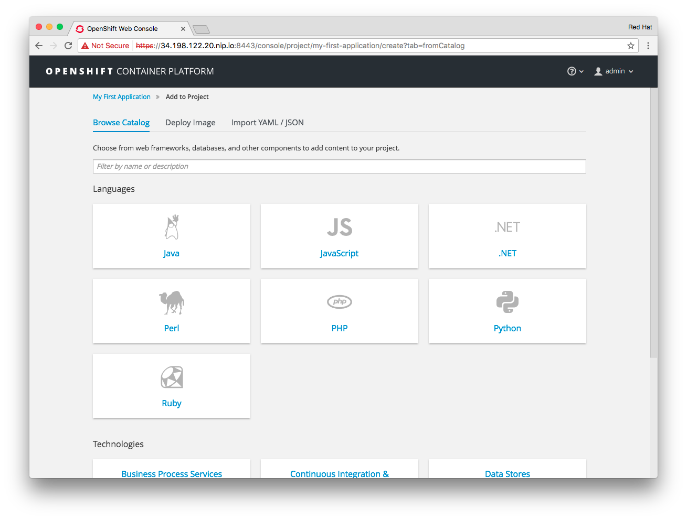

!!! Summary "Overview"
    This module is a *crash course* in OpenShift intended for Storage Solution Architects. You can safely skip this if you have existing working knowledge in OpenShift Container Platform

OpenShift in a nutshell
----------------------

*OpenShift Container Platform* (OCP) is Red Hat's productization of the Kubernetes project. 80% of OpenShift is based on it.
Kubernetes is a container orchestration engine for running docker-formatted containers at scale in a distributed environment.

OpenShifts main purpose is to allow a developer to focus on writing applications. They can leave it to OpenShift how to schedule and run those.

In the simplest form, a user supplies a URL to a source code repository. OCP takes it from there. It will know how to build the application, how to package it in a container image, run one or more instances of that image and make the application accessible to the outside world.

---

Application Lifecycle with OpenShift
------------------------------------

Let's walk through the basic workflow at an example.

!!! Tip
    For each task we will provide instructions for the UI as well as the equivalent on the CLI.

##### Logging in

&#8680; Log on to the OpenShift User Interface with the URL provided in the [Overview section](../) section as user `developer` with password `r3dh4t`:

*click on the screenshot for better resolution*

The UI focusses mainly on the tasks a developer / user would carry out. Administrative tasks are CLI only.

!!! Note
    The `oc` client is the primary CLI tool to access and manipulate entities in an OpenShift deployment.
    Basic syntax is always `$ oc <command>`

&#8680; On the CLI you use the pre-installed `oc` tool (OpenShift Client). Log on to the master node with it's public IP provided in the [Overview section](../) section:

~~~~
ssh -i ~/qwiklabs.pem -l ec2-user <your-public-IP>
~~~~

~~~~
oc login -u developer
~~~~

Log on with the password `r3dh4t`:

    Authentication required for https://master.lab:8443 (openshift)
    Username: admin
    Password:
    Login successful.

    You don't have any projects. You can try to create a new project, by running

        oc new-project <projectname>

---

##### Exploring the environment

!!! Note
    The operations in this step can only be done on the command line and require cluster admin privileges in OpenShift. By default these are not available to anyone else than the built-in system admin.

&#8680; Log on with the built-in system admin (no password required)

    oc login -u system:admin

&#8680; Add cluster admin privileges to the `operator` user in order to have an administrative user capable of logging into externally:

    oadm policy add-cluster-role-to-user cluster-admin operator

&#8680; Now login in as `operator` to the `default` namespace with password `r3dh4t`

    oc login -u operator -n default

&#8680; Display all available nodes in the system

    oc get nodes

You should see 7 nodes in **READY** state:

    NAME         STATUS    AGE
    master.lab   Ready     1h
    node-1.lab   Ready     1h
    node-2.lab   Ready     1h
    node-3.lab   Ready     1h
    node-4.lab   Ready     1h
    node-5.lab   Ready     1h
    node-6.lab   Ready     1h

&#8680; A slight variant of that command will show us some tags (called *labels*):

    oc get nodes --show-labels

You should see that 1 node has the label `region=infra` applied whereas the other 6 have `region=apps` set:

    NAME         STATUS    AGE       LABELS
    master.lab   Ready     1h        beta.kubernetes.io/arch=amd64,beta.kubernetes.io/os=linux,kubernetes.io/hostname=master.lab,region=infra
    node-1.lab   Ready     1h        beta.kubernetes.io/arch=amd64,beta.kubernetes.io/os=linux,kubernetes.io/hostname=node-1.lab,region=apps
    node-2.lab   Ready     1h        beta.kubernetes.io/arch=amd64,beta.kubernetes.io/os=linux,kubernetes.io/hostname=node-2.lab,region=apps
    node-3.lab   Ready     1h        beta.kubernetes.io/arch=amd64,beta.kubernetes.io/os=linux,kubernetes.io/hostname=node-3.lab,region=apps
    node-4.lab   Ready     1h        beta.kubernetes.io/arch=amd64,beta.kubernetes.io/os=linux,kubernetes.io/hostname=node-4.lab,region=apps
    node-5.lab   Ready     1h        beta.kubernetes.io/arch=amd64,beta.kubernetes.io/os=linux,kubernetes.io/hostname=node-5.lab,region=apps
    node-6.lab   Ready     1h        beta.kubernetes.io/arch=amd64,beta.kubernetes.io/os=linux,kubernetes.io/hostname=node-6.lab,region=apps

These are the "physical" systems available to OpenShift. One of them is special: the master. It runs important system services like schedulers, container registries and a database. Labels on hosts are used as a selector for scheduling decisions.
Non-master nodes run containerized applications.

&#8680; Display the current project context or namespace:

    oc project

You should be in the default namespace:

    Using project "default" on server "https://master.lab:8443".

&#8680; Display the running containers in this namespace.

    oc get pods

!!! Note:
    Containers are not the smallest entity OpenShift/Kubernetes knows about. **Pods** are. Pods typically run a single container only and are subject to scheduling, networking and storage configuration.
    There are some corner cases in which multiple containers run in a single pod. Then they share a single IP address, all storage and are always scheduled together.

You should have the 3 default services running in pods that every OpenShift deployment has:

    NAME                       READY     STATUS    RESTARTS   AGE
    docker-registry-1-rktxs    1/1       Running   0          1h
    registry-console-1-28hlh   1/1       Running   0          1h
    router-1-0btlh             1/1       Running   0          1h

The registry is where images that get created in OpenShift are stored. The registry console is a Web UI for the container registry. The router is an HAproxy instance running internally in OpenShift, exposing applications to the external network.

&#8680; Finally get more information about the deployment with this command:

    oc status

You see output similar to this:

    In project default on server https://master.lab:8443

    https://docker-registry-default.cloudapps.34.198.122.20.nip.io (passthrough) (svc/docker-registry)
    dc/docker-registry deploys docker.io/openshift3/ose-docker-registry:v3.5.5.15
    deployment #1 deployed 2 hours ago - 1 pod

    svc/kubernetes - 172.30.0.1 ports 443, 53->8053, 53->8053

    https://registry-console-default.cloudapps.34.198.122.20.nip.io (passthrough) (svc/registry-console)
    dc/registry-console deploys registry.access.redhat.com/openshift3/registry-console:3.5
    deployment #1 deployed 2 hours ago - 1 pod

    svc/router - 172.30.63.192 ports 80, 443, 1936
    dc/router deploys docker.io/openshift3/ose-haproxy-router:v3.5.5.15
    deployment #1 deployed 2 hours ago - 1 pod

    View details with 'oc describe <resource>/<name>' or list everything with 'oc get all'.

If these 3 pods are in place your environment is working.

&#8680; Now log out from the operator session:

    oc logout

---

##### Creating a Project

Similar to OpenStack *Projects* exists in OpenShift. They group users, objects and quotas in the system. They are also called *namespaces*. Nothing can exist outside a project/namespace.

&#8680; Select **New Project** in the UI. Enter at least a system name, optionally a human-readable name (label) and a description.

&#8680; To do this on the CLI log back in as the `developer` user with the password `r3dh4t`:

    oc login -u developer

&#8680; Create a new project with the `oc` client:

    oc new-project my-first-app \
      --display-name="My First Application" \
      --description="My first application on OpenShift Container Platform"

---

##### Creating an Application

In the UI you should be looking at the following overview page:

If not, click on the OpenShift Product Logo in the upper left hand corner, select your project again and select **Add to Project**.

&#8680; From the catalog select the category **Ruby** from the group of available runtime environments.

OpenShift ships a number of useful example of simple and more complex application stacks in the form of templates. These are a great way to see how OpenShift supports application development and deployment.

&#8680; Select the example app template labeled **Rails + PostgreSQL (Ephemeral)**

The template specifies various OpenShift resources, some of which are customizable via parameters. This page allows to override these parameters with custom values.

We will accept the defaults. Note the GitHub repository URL - this is where the code for this app will come from.

&#8680; Click **Create** to start the app deployment:

&#8680; Click **Continue to Overview** to follow the deployment process

After a few minutes the deployment is done.

&#8680; Click on the link provided starting with **http://rails-postgresql-example-my-first-app.cloudapps...** in the upper right hand corner to get to the application instances.

!!! Note
    The URL will be slightly different for you as it contains the public IP address of your environment.

On the CLI the process would have been kicked off with this command chain:

    oc export template/rails-postgresql-example -n openshift | oc process -f - | oc create -f -

Don't worry about the exact mechanics of this method - it will be explained in a later module.

At this point you deployed an application stack consisting of a database pod and a pod running the Ruby on Rails app.
That's it. The application has been built from source and deployed from scratch.

There is only one problem. The database stores it's data internally in the pod's ephemeral local filesystem. This data would be lost as soon as the pod terminates or gets rescheduled.

In OpenShift infrastructure is considered immutable. So any configuration changes will actually redeploy application infrastructure like pods. That's why pods must not store any data locally.

!!! Note
    At this point 5 minutes are probably over. For the curious reader there is an extra section below that explains what has happened in the background.

    It's not crucial for this lab - so feel free to skip it.

---

##### Bonus: Exploring the application infrastructure

What has happened behind the scenes in the previous step in a nutshell:

1. A Git repository with the applications source code was provided to OpenShift

1. OpenShift was instructed to build a Ruby application from the source

1. The Ruby application was packaged into a container image alongside the Ruby on Rails runtime

1. A pointer to an existing container image containing a PostgresSQL database installation was provided

1. An instance of postgres container image was started, with configuration supplied via environment variables

1. An instance of the ruby app container image was started with connection data to the database container supplied via environment variables

1. An internal forwarding mechanism was put in place based on a custom subdomain for the app below \*.cloudapps.<your-domain-name\>.com

Let's look at the objects and resources in OpenShif that where created during this process.

&#8680; In the OpenShift UI, click the link labeled `postgresql` in the right hand box

What you will see is known as `DeploymentConfig` in OpenShift. It is an instruction how to run instances of a certain container image, i.e. how many instances, how much resources per container, whether to apply auto-scaling and what to do when the deployment config get's changed.

Click on the **Configuration** tab in the `DeploymentConfig` to look at this.

When the config changes (e.g. increase number of container from 1 to 2) a new deployment will be triggered. The container(s) will be recreated from scratch. This follows the principle of *immutable infrastructre*.

&#8680; Click on the **History** tab to see a list of all deployments of this config so far (should be only 1).

Deployments are versioned with simple integers.

&#8680; Click on version **#1** which should be the latest version.

This deployment contains exactly one container instance of the postgres image. A container is handled in OpenShift/Kubernetes within the concept of a **Pod**.
A pod is a logical entity to abstract the fact that there could be multiple container instances scheduled as a single entity (with a single IP, single set of environment variables, storage etc.). In 90% of the case 1 pod = 1 container.

&#8680; Scroll down to see the pods associated with this deployment. Click it.

This will show you the environment in which the pod runs. On which node, under what IP address etc. Explore the various tabs shown here. They will tell you the environment variables available to this pod, it's output so far and various events OpenShift recorded during it's lifetime.

&#8680; On the CLI you can look at the DeploymentConfig like this:

    oc get deploymentconfig

You'll see there are actually two DeploymentConfig objects, the other one is for the ruby app container.

    NAME                       REVISION   DESIRED   CURRENT   TRIGGERED BY
    postgresql                 1          1         1         config,image(postgresql:9.5)
    rails-postgresql-example   1          1         1         config,image(rails-postgresql-example:latest)

&#8680; You can get more information on a specific object like this:

    oc describe dc/postgresql

The output will more or less show the same as the UI but in plain text.

&#8680; In the UI go back to the `Overview`. Click on the link labeled `rails-postgresql-example` above the `DeploymentConfig` of the same name.

What you see is a `Service`. Think of it as a cluster virtual-IP for a set of containers. The `Service` IP will be constant while pod IPs can change with pods getting rescheduled, new instances spawned etc. The `Service` will also forward network traffic on a certain port to a certain port on the pods.
It will do this in a round-robin fashion.

However as you can tell even the `Service` IP is still internal to OpenShift. This is where `Routes` come in.

&#8680; From the sidebar select **Applications** > **Routes**

&#8680; Click the entry labelled `rails-postgresql-example`

A `Route` in OpenShift is a way of exposing a `Service` to the public. While a `Service` is what pods in OpenShift internally would use to talk to other pods, a `Route` is used by external clients like humans.
