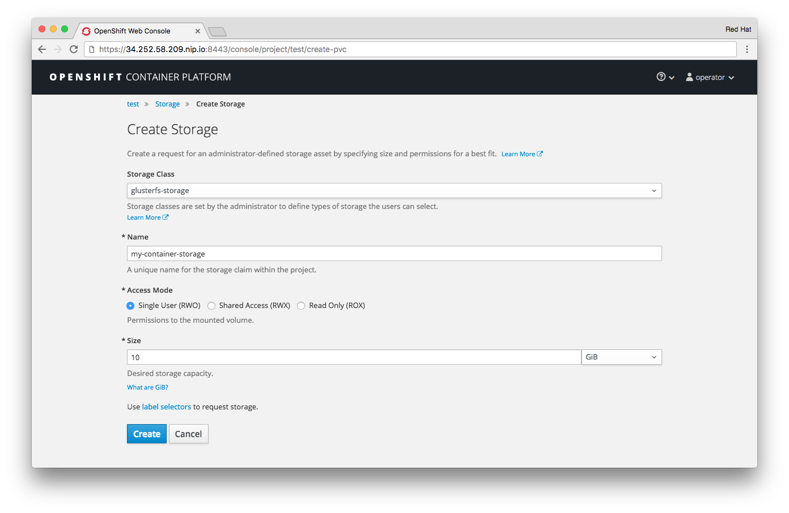

!!! Summary "Overview"
    In this module you will use CNS as a developer would do in OpenShift. For that purpose you will dynamically provision storage both in standalone fashion and in context of an application deployment.

Creating a StorageClass
-----------------------

OpenShift uses Kubernetes' PersistentStorage facility to dynamically allocate storage of any kind for applications. This is a fairly simple framework in which only 3 components exists: the storage provider, the storage volume and the request for a storage volume.

[](img/cns_diagram_pvc.svg)

OpenShift knows non-ephemeral storage as "persistent" volumes. This is storage that is decoupled from pod lifecycles. Users can request such storage by submitting a *PersistentVolumeClaim* to the system, which carries aspects like desired capacity or access mode (shared, single, read-only).

A storage provider in the system is represented by a *StorageClass* and is referenced in the claim. Upon receiving the claim it talks to the API of the actual storage system to provision the storage.  

The provisioned storage is represented in OpenShift as a *PersistentVolume* which can directly be used by pods to mount it.

With these basics defined we can configure our system for CNS. First we will set up the credentials for CNS in OpenShift.

&#8680; Make sure you are logged on as `operator` and you are in the `default` namespace:

    oc whoami

&#8680; If you are not `operator` log in again to the default namespace

    oc login -u operator -n default

&#8680; Create an encoded value for the CNS admin user like below:

    echo -n "myS3cr3tpassw0rd" | base64

The encoded string looks like this:

    bXlTM2NyM3RwYXNzdzByZA==

We will store this encoded value in an OpenShift secret.

&#8680; Create a file called `cns-secret.yml` with contents like below (highlight shows where to put encoded password):

<kbd>cns-secret.yml:</kbd>

```yaml hl_lines="7"
apiVersion: v1
kind: Secret
metadata:
  name: cns-secret
  namespace: default
data:
  key: bXlTM2NyM3RwYXNzdzByZA==
type: kubernetes.io/glusterfs
```

&#8680; Create the secret in OpenShift with the following command:

    oc create -f cns-secret.yml

To represent CNS as a storage provider in the system you first have to create a `StorageClass`. Define it by creating a file called `cns-storageclass.yml` which references the secret and the heketi URL shown earlier with the contents as below:

!!! Warning "Important"
    Replace the `resturl` parameter with your heketi URL.

<a name="storageclass-setup"></a>

<kbd>cns-storageclass.yml:</kbd>
```yaml
apiVersion: storage.k8s.io/v1beta1
kind: StorageClass
metadata:
  name: container-native-storage
  annotations:
    storageclass.beta.kubernetes.io/is-default-class: "true"
provisioner: kubernetes.io/glusterfs
parameters:
  resturl: "http://heketi-container-native-storage.cloudapps.34.252.58.209.nip.io"
  restauthenabled: "true"
  restuser: "admin"
  volumetype: "replicate:3"
  secretNamespace: "default"
  secretName: "cns-secret"
```

&#8680; Create the StorageClass in OpenShift with the following command:

    oc create -f cns-storageclass.yml

With these components in place the system is ready to dynamically provision storage capacity from Container-native Storage.

---

Requesting Storage
------------------

To get storage provisioned as a user you have to "claim" storage. The `PersistentVolumeClaim` (PVC) basically acts a request to the system to provision storage with certain properties, like a specific capacity.  
Also the access mode is set here, where *ReadWriteOnce* allows one container at a time to mount and access this storage.

&#8680; Where are going to do this as a regular OpenShift user. Login in as `developer`:

    oc login -u developer

&#8680; Create a new project called `playground` for this exercise:

    oc new-project playground

&#8680; Create a claim by specifying a file called `cns-pvc.yml` with the following contents:

<kbd>cns-pvc.yml:</kbd>
```yaml
kind: PersistentVolumeClaim
apiVersion: v1
metadata:
  name: my-container-storage
  annotations:
    volume.beta.kubernetes.io/storage-class: container-native-storage
spec:
  accessModes:
  - ReadWriteOnce
  resources:
    requests:
      storage: 10Gi
```
With above PVC we are requesting 10 GiB of non-shared storage. Instead of *ReadWriteOnce* you could also have specified *ReadWriteOnly* (for read-only) and *ReadWriteMany* (for shared storage).

&#8680; Submit the PVC to the system like so:

    oc create -f cns-pvc.yml

&#8680; After a couple of seconds, look at the requests state with the following command:

    oc get pvc

You should see the PVC listed and in *Bound* state.

    NAME                   STATUS    VOLUME                                     CAPACITY   ACCESSMODES   AGE
    my-container-storage   Bound     pvc-382ac13d-4a9f-11e7-b56f-2cc2602a6dc8   10Gi       RWO           16s

!!! Note
    It may take a couple seconds for the claim to be in **bound**.

!!! Caution
    If the PVC is stuck in *PENDING* state you will need to investigate. Run `oc describe pvc/my-container-storage` to see a more detailed explanation. Typically there are two root causes - the StorageClass is not properly setup (wrong name, wrong credentials, incorrect secret name, wrong heketi URL, heketi service not up, heketi pod not up…) or the PVC is malformed (wrong StorageClass, name already taken …)

!!! Tip
    You can also do this step with the UI. Log on as `developer` and select or create a Project. Then go to the "Storage" tab. Select "Create" storage and make selections accordingly to the PVC described before.

    [](img/openshift_pvc_create.png)

When the claim was fulfilled successfully it is in the *Bound* state. That means the system has successfully (via the `StorageClass`) reached out to the storage backend (in our case GlusterFS). The backend in turn provisioned the storage and provided a handle back OpenShift. In OpenShift the provisioned storage is then represented by a `PersistentVolume` (PV) which is *bound* to the PVC.

&#8680; Look at the PVC for these details:

    oc describe pvc/my-container-storage

The details of the PVC show against which `StorageClass` it has been submitted and the name of the `PersistentVolume` which was generated to fulfill the claim.

``` hl_lines="1 5"
Name:           my-container-storage
Namespace:      playground
StorageClass:   container-native-storage
Status:         Bound
Volume:         pvc-382ac13d-4a9f-11e7-b56f-2cc2602a6dc8
Labels:         <none>
Capacity:       10Gi
Access Modes:   RWO
No events.
```

!!! Note
    The PV name will be different in your environment since it’s automatically generated.

In order to look at a the details of a PV in a default setup like this you need more privileges.

&#8680; For convenience just log in as `operator` to this project:

    oc login -u operator -n playground

&#8680; Look at the corresponding PV by it’s name:

    oc describe pv/pvc-382ac13d-4a9f-11e7-b56f-2cc2602a6dc8

The output shows several interesting things, like the access mode (RWO = ReadWriteOnce), the reclaim policy (what happens when the PV object gets deleted), the capacity and the type of storage backing this PV (in our case GlusterFS as part of CNS):

``` hl_lines="4 5 6 7 8 11"
Name:           pvc-382ac13d-4a9f-11e7-b56f-2cc2602a6dc8
Labels:         <none>
StorageClass:   container-native-storage
Status:         Bound
Claim:          container-native-storage/my-container-storage
Reclaim Policy: Delete
Access Modes:   RWO
Capacity:       10Gi
Message:
Source:
    Type:               Glusterfs (a Glusterfs mount on the host that shares a pod's lifetime)
    EndpointsName:      glusterfs-dynamic-my-container-storage
    Path:               vol_304670f0d50bf5aa4717a69652bd48ff
    ReadOnly:           false
No events.
```

!!! Tip "Why is it called *Bound*?"
    Originally PVs weren't automatically created. Hence in earlier documentation you may also find references about administrators actually **pre-provisioning** PVs. Later PVCs would "pick up" a suitable PV by looking at it’s capacity. When successful they are *bound* to this PV.
    This was needed for storage like NFS that does not have an API and therefore does not support **dynamic provisioning**. Hence it's called **static provisioning**.
    This kind of storage should not be used anymore as it requires manual intervention, risky capacity planning and incurs inefficient storage utilization.

Let’s release this storage capacity again.
Storage is freed up by deleting the **PVC**. The PVC controls the lifecycle of the storage, not the PV.

!!! Caution "Important"
    Never delete PVs that are dynamically provided. They are only handles for pods mounting the storage. Storage lifecycle is entirely controlled via PVCs.

&#8680; Delete the storage by deleting the PVC like this:

    oc delete pvc/my-container-storage

---

Using non-shared storage for databases
--------------------------------------

Normally a user doesn’t request storage with a PVC directly. Rather the PVC is integrated in a larger template that describe the entire application. Such examples ship with OpenShift out of the box.

!!! Tip:
    The steps described in this section can again also be done with the UI. For this purpose follow these steps similar to the one in Module 1:

    > 1.  Log on to the OpenShift UI as the `developer` user

    > 1.  Create a new project called 'my-test-project', label and description is optional

    > 1.  In the Overview, next to the project’s name select *Add to project*

    > 1.  In the *Browse Catalog* view select *Ruby* from the list of programming languages

    > 1.  Select the example app entitled *Rails + PostgreSQL (Persistent)*

    > 1.  (optional) Change the *Volume Capacity* parameter to something greater than 1GiB, e.g. 15 GiB

    > 1.  Select *Create* to start deploying the app

    > 1.  Select *Continue to Overview* in the confirmation screen

    > 1.  Wait for the application deployment to finish and continue below at

---

To create an application from the OpenShift Example templates on the CLI follow these steps.

&#8680; Log in as `developer`

    oc login -u developer

&#8680; Create a new project with a name of your choice:

    oc new-project my-test-project

To use the example applications that ship with OpenShift we can export and modify the template for a sample Ruby on Rails with PostgreSQL application. All these templates ship in pre-defined namespace called `openshift`.

&#8680; Export the template from the `openshift` namespace in YAML format:

    oc export template/rails-pgsql-persistent -n openshift -o yaml > rails-app-template.yml

In the file `rails-app-template.yml` you can now review the template for this entire application stack in all it’s glory.

!!! Hint "What does the template file contain?"
    In essence it creates Ruby on Rails instance in a pod which functionality mimics a very basic blogging application. The blog articles are saved in a PostgreSQL database which runs in a separate pod.
    The template describes all OpenShift resources necessary to stand up the rails pod and the postgres pod and make them accessible via services and routes.
    In addition a PVC is issued (line 194) to supply this pod with persistent storage below the mount point `/var/lib/pgsql/data` (line 275).

The template contains a couple of parameters which default values we can override.

!!! Tip
    To list all available parameters from this template run `oc process -f rails-app-template.yml --parameters`
    The `oc process` command parses the template and replaces any parameters with their default values if not supplied explicitly like in the next step.

There is a parameter in the template is called `VOLUME_CAPACITY`. It is used to customize the capacity in the PVC. We will process the template with the CLI client and override this parameter with a value of *15Gi* as follows:

&#8680; Render the template with the custom parameter value as follows:

    oc process -f rails-app-template.yml -o yaml -p VOLUME_CAPACITY=15Gi > my-rails-app.yml


The result `my-rails-app.yml` file contains all resources including our custom PVC for this application.

&#8680; Deploy these resources like so:

    oc create -f my-rails-app.yml

Among various OpenShift resource also our PVC will be created:

``` hl_lines="7"
secret "rails-pgsql-persistent" created
service "rails-pgsql-persistent" created
route "rails-pgsql-persistent" created
imagestream "rails-pgsql-persistent" created
buildconfig "rails-pgsql-persistent" created
deploymentconfig "rails-pgsql-persistent" created
persistentvolumeclaim "postgresql" created
service "postgresql" created
deploymentconfig "postgresql" created
```

You can now use the OpenShift UI (while being logged in the newly created project) to follow the deployment process.

&#8680; Alternatively watch the containers deploy like this:

    oc get pods -w

The complete output should look like this:

    NAME                             READY     STATUS              RESTARTS   AGE
    postgresql-1-deploy              0/1       ContainerCreating   0          11s
    rails-pgsql-persistent-1-build   0/1       ContainerCreating   0          11s
    NAME                  READY     STATUS    RESTARTS   AGE
    postgresql-1-deploy   1/1       Running   0          14s
    postgresql-1-81gnm   0/1       Pending   0         0s
    postgresql-1-81gnm   0/1       Pending   0         0s
    rails-pgsql-persistent-1-build   1/1       Running   0         19s
    postgresql-1-81gnm   0/1       Pending   0         15s
    postgresql-1-81gnm   0/1       ContainerCreating   0         16s
    postgresql-1-81gnm   0/1       Running   0         47s
    postgresql-1-81gnm   1/1       Running   0         4m
    postgresql-1-deploy   0/1       Completed   0         4m
    postgresql-1-deploy   0/1       Terminating   0         4m
    postgresql-1-deploy   0/1       Terminating   0         4m
    rails-pgsql-persistent-1-deploy   0/1       Pending   0         0s
    rails-pgsql-persistent-1-deploy   0/1       Pending   0         0s
    rails-pgsql-persistent-1-deploy   0/1       ContainerCreating   0         0s
    rails-pgsql-persistent-1-build   0/1       Completed   0         11m
    rails-pgsql-persistent-1-deploy   1/1       Running   0         6s
    rails-pgsql-persistent-1-hook-pre   0/1       Pending   0         0s
    rails-pgsql-persistent-1-hook-pre   0/1       Pending   0         0s
    rails-pgsql-persistent-1-hook-pre   0/1       ContainerCreating   0         0s
    rails-pgsql-persistent-1-hook-pre   1/1       Running   0         6s
    rails-pgsql-persistent-1-hook-pre   0/1       Completed   0         15s
    rails-pgsql-persistent-1-dkj7w   0/1       Pending   0         0s
    rails-pgsql-persistent-1-dkj7w   0/1       Pending   0         0s
    rails-pgsql-persistent-1-dkj7w   0/1       ContainerCreating   0         0s
    rails-pgsql-persistent-1-dkj7w   0/1       Running   0         1m
    rails-pgsql-persistent-1-dkj7w   1/1       Running   0         1m
    rails-pgsql-persistent-1-deploy   0/1       Completed   0         1m
    rails-pgsql-persistent-1-deploy   0/1       Terminating   0         1m
    rails-pgsql-persistent-1-deploy   0/1       Terminating   0         1m
    rails-pgsql-persistent-1-hook-pre   0/1       Terminating   0         1m
    rails-pgsql-persistent-1-hook-pre   0/1       Terminating   0         1m

Exit out of the watch mode with: <kbd>Ctrl</kbd> + <kbd>c</kbd>

!!! Note:
    It may take up to 7 minutes for the deployment to complete.

    If you did it via the UI the deployment is finished when both, rails app and postgres database are up and running:

    [](img/openshift_rails_deploy.png)

You should also see a PVC being issued and in the *Bound* state.

&#8680; Look at the PVC created:

    oc get pvc/postgresql

Output:

    NAME         STATUS    VOLUME                                     CAPACITY   ACCESSMODES   AGE
    postgresql   Bound     pvc-6c348fbb-4e9d-11e7-970e-0a9938370404   15Gi       RWO           4m

!!! Tip "Why did this even work?"
    If you paid close attention you likely noticed that the PVC in the template does not specify a particular `StorageClass`. This still yields a PV deployed because our `StorageClass` has actually been defined as the system-wide default. PVCs that don't specify a `StorageClass` will use the default class.

Now go ahead and try out the application. The overview page in the OpenShift UI will tell you the `route` which has been deployed as well (the http://... link in the upper right hand corner). Use it and append `/articles` to the URL to get to the actual app.

&#8680; Otherwise get it on the CLI like this:

    oc get route

Output:

    NAME                     HOST/PORT                                                               PATH      SERVICES                 PORT      TERMINATION   WILDCARD
    rails-pgsql-persistent   rails-pgsql-persistent-my-test-project.cloudapps.34.252.58.209.nip.io             rails-pgsql-persistent   <all>                   None

!!! Note:
    Again, the URL will be slightly different for you.

Following this output, point your browser to the URL and append **/articles** to reach the actual application, in this case:

http://*rails-pgsql-persistent-my-test-project.cloudapps.34.252.58.209.nip.io*/**articles**

You should be able to successfully create articles and comments. The username/password to create articles and comments is by default **openshift**/**secret**.
When they are saved they are actually saved in the PostgreSQL database which stores it’s table spaces on a GlusterFS volume provided by CNS.

&#8680; You can verify that the postgres pod indeed mounted the PVC under the pather where PostgreSQL normally stores it's data with this command:

    oc volumes dc --all

You will see that the `DeploymentConfig` of the postgres pod did indeed include a PVC:

    deploymentconfigs/postgresql
      pvc/postgresql (allocated 15GiB) as postgresql-data
        mounted at /var/lib/pgsql/data
    deploymentconfigs/rails-pgsql-persistent

Now let’s take a look at how this was actually achieved.

&#8680; A normal user cannot see the details of a PersistentVolume. Log in as `operator`:

    oc login -u operator -n my-test-project

&#8680; Look at the PVC to determine the PV:

    oc get pvc

Output:

    NAME         STATUS    VOLUME                                     CAPACITY   ACCESSMODES   AGE
    postgresql   Bound     pvc-6c348fbb-4e9d-11e7-970e-0a9938370404   15Gi       RWO           10m

!!! Note
    Your volume (PV) name will be different as it’s dynamically generated.

The PVC name is found in above output the `VOLUME` column.

&#8680; Look at the details of this PV:

    oc describe pv/pvc-6c348fbb-4e9d-11e7-970e-0a9938370404

Output shows (in highlight) the name of the volume, the backend type (GlusterFS) and the volume name GlusterFS uses internally.

``` hl_lines="1 11 13"
Name:		pvc-6c348fbb-4e9d-11e7-970e-0a9938370404
Labels:		<none>
StorageClass:	container-native-storage
Status:		Bound
Claim:		my-test-project/postgresql
Reclaim Policy:	Delete
Access Modes:	RWO
Capacity:	15Gi
Message:
Source:
    Type:		Glusterfs (a Glusterfs mount on the host that shares a pod's lifetime)
    EndpointsName:	glusterfs-dynamic-postgresql
    Path:		vol_efac3ddb9d339fa680c0807a1d91c5a3
    ReadOnly:		false
No events.
```

Note the GlusterFS volume name, in this case `vol_e8fe7f46fedf7af7628feda0dcbf2f60`.

&#8680; Now let’s switch to the namespace we used for CNS deployment:

    oc project container-native-storage

&#8680; Look at the GlusterFS pods running

    oc get pods -o wide

Pick one of the GlusterFS pods by name (which one is not important):

    NAME              READY     STATUS    RESTARTS   AGE       IP           NODE
    glusterfs-5rc2g   1/1       Running   0          51m       10.0.2.101   node-1.lab
    glusterfs-jbvdk   1/1       Running   0          51m       10.0.3.102   node-2.lab
    glusterfs-rchtr   1/1       Running   0          51m       10.0.4.103   node-3.lab
    heketi-1-tn0s9    1/1       Running   0          49m       10.130.2.3   node-6.lab

**Remember the IP address** of the pod you select. In this case `10.0.2.101`.

&#8680; Log on to GlusterFS pod with a remote terminal session like so:

    oc rsh glusterfs-5rc2g

You will end up in shell session in the container with root privileges.

    sh-4.2#

You have now access to this container’s process and filesystem namespace which has the GlusterFS CLI utilities installed.

&#8680; Let’s list all known volumes:

    sh-4.2# gluster volume list

You will see two volumes:

    heketidbstorage
    vol_efac3ddb9d339fa680c0807a1d91c5a3

-   `heketidbstorage` is a internal-only volume dedicated to heketi’s internal database.

-   `vol_efac3ddb9d339fa680c0807a1d91c5a3` is the volume backing the PV of the PostgreSQL database deployed earlier.

&#8680; Interrogate GlusterFS about the topology of this volume:

    sh-4.2# gluster volume info vol_efac3ddb9d339fa680c0807a1d91c5a3

The output will show you how the volume has been created. You will also see that the pod you are currently logged on to serves one the bricks (in highlight).

``` hl_lines="10"
Volume Name: vol_efac3ddb9d339fa680c0807a1d91c5a3
Type: Replicate
Volume ID: cfaccdec-3c97-4e43-b80f-c9677e7a726a
Status: Started
Snapshot Count: 0
Number of Bricks: 1 x 3 = 3
Transport-type: tcp
Bricks:
Brick1: 10.0.3.102:/var/lib/heketi/mounts/vg_8ea71174529a35f41fc0d1b288da6299/brick_b2e6975e246d896038604a7c0efcd83f/brick
Brick2: 10.0.2.101:/var/lib/heketi/mounts/vg_2a49883a5cb39c3b845477ff85a729ba/brick_c5b00eeae2c57862b4eddeeb9b3903ad/brick
Brick3: 10.0.4.103:/var/lib/heketi/mounts/vg_41b8a921f8e6d31cb04c7dd35b6b4cf2/brick_4f691eb2ba90a3ee31cb882f12786400/brick
Options Reconfigured:
transport.address-family: inet
performance.readdir-ahead: on
nfs.disable: on
```

!!! Note
    Identify the right brick by looking at the host IP of the pod you have just logged on to. `oc get pods -o wide` will give you this information.

GlusterFS created this volume as a 3-way replica set across all GlusterFS pods, therefore across your OpenShift App nodes running CNS. This is currently the only supported volume type in production. In [Module 5](module-5-advanced.md) you will see how to provision (unsupported) volume types like dispersed or distributed.

&#8680; You can even look at the local brick:

    sh-4.2# ls -ahl /var/lib/heketi/mounts/vg_2a49883a5cb39c3b845477ff85a729ba/brick_c5b00eeae2c57862b4eddeeb9b3903ad/brick
    total 16K
    drwxrwsr-x.   5 root       2001   57 Jun  6 14:44 .
    drwxr-xr-x.   3 root       root   19 Jun  6 14:44 ..
    drw---S---. 263 root       2001 8.0K Jun  6 14:46 .glusterfs
    drwxr-sr-x.   3 root       2001   25 Jun  6 14:44 .trashcan
    drwx------.  20 1000080000 2001 8.0K Jun  6 14:46 userdata

    sh-4.2# ls -ahl /var/lib/heketi/mounts/vg_2a49883a5cb39c3b845477ff85a729ba/brick_c5b00eeae2c57862b4eddeeb9b3903ad/brick/userdata

    total 68K
    drwx------. 20 1000080000 2001 8.0K Jun  6 14:46 .
    drwxrwsr-x.  5 root       2001   57 Jun  6 14:44 ..
    -rw-------.  2 1000080000 root    4 Jun  6 14:44 PG_VERSION
    drwx------.  6 1000080000 root   54 Jun  6 14:46 base
    drwx------.  2 1000080000 root 8.0K Jun  6 14:47 global
    drwx------.  2 1000080000 root   18 Jun  6 14:44 pg_clog
    drwx------.  2 1000080000 root    6 Jun  6 14:44 pg_commit_ts
    drwx------.  2 1000080000 root    6 Jun  6 14:44 pg_dynshmem
    -rw-------.  2 1000080000 root 4.6K Jun  6 14:46 pg_hba.conf
    -rw-------.  2 1000080000 root 1.6K Jun  6 14:44 pg_ident.conf
    drwx------.  2 1000080000 root   32 Jun  6 14:46 pg_log
    drwx------.  4 1000080000 root   39 Jun  6 14:44 pg_logical
    drwx------.  4 1000080000 root   36 Jun  6 14:44 pg_multixact
    drwx------.  2 1000080000 root   18 Jun  6 14:46 pg_notify
    drwx------.  2 1000080000 root    6 Jun  6 14:44 pg_replslot
    drwx------.  2 1000080000 root    6 Jun  6 14:44 pg_serial
    drwx------.  2 1000080000 root    6 Jun  6 14:44 pg_snapshots
    drwx------.  2 1000080000 root    6 Jun  6 14:46 pg_stat
    drwx------.  2 1000080000 root   84 Jun  6 15:16 pg_stat_tmp
    drwx------.  2 1000080000 root   18 Jun  6 14:44 pg_subtrans
    drwx------.  2 1000080000 root    6 Jun  6 14:44 pg_tblspc
    drwx------.  2 1000080000 root    6 Jun  6 14:44 pg_twophase
    drwx------.  3 1000080000 root   60 Jun  6 14:44 pg_xlog
    -rw-------.  2 1000080000 root   88 Jun  6 14:44 postgresql.auto.conf
    -rw-------.  2 1000080000 root  21K Jun  6 14:46 postgresql.conf
    -rw-------.  2 1000080000 root   46 Jun  6 14:46 postmaster.opts
    -rw-------.  2 1000080000 root   89 Jun  6 14:46 postmaster.pid

!!! Note
    The exact path name will be different in your environment as it has been automatically generated.

You are looking at the PostgreSQL internal data file structure from the perspective of the GlusterFS server side. Evidence that the database uses CNS.

Clients, like the OpenShift nodes and their application pods talk to this storage with the GlusterFS protocol as it were an ordinary GlusterFS deployment.
When a pod starts that mounts storage from a PV backed by CNS the GlusterFS mount plugin in OpenShift will mount the GlusterFS volume on the right App Node and then *bind-mount* this directory to the right pod.  
This happens transparently to the application and looks like a normal local filesystem inside the pod.

&#8680; You may exit your remote session to the GlusterFS pod.

    sh-4.2# exit

---

Providing shared storage to multiple application instances
----------------------------------------------------------

In the previous example we provisioned an RWO PV - the volume is only usable with one pod at a time. RWO is what most of the OpenShift storage backends support.
So far only very few options, like the basic NFS support existed, to provide a `PersistentVolume` to more than one container at once. The access mode used for this is **ReadWriteMany**.

With CNS this capability is now available to all OpenShift deployments, no matter where they are deployed. To demonstrate this capability with an application we will deploy a PHP-based file uploader that has multiple front-end instances sharing a common storage repository.

&#8680; Log back in as developer

    oc login -u developer

&#8680; First make sure you are still in the example project created earlier

    oc project my-test-project

&#8680; Next deploy the example application:

    oc new-app openshift/php:7.0~https://github.com/christianh814/openshift-php-upload-demo --name=file-uploader

!!! Note
    This is yet another way to build and launch an application from source code in OpenShift. The content before the ~ is the name of a Source-to-Image builder (a container that knows how to build applications of a certain type from source, in this case PHP) and the URL following is a GitHub repository hosting the source code.
    Feel free to check it out.

Output:

    --> Found image a1ebebb (6 weeks old) in image stream "openshift/php" under tag "7.0" for "openshift/php:7.0"

        Apache 2.4 with PHP 7.0
        -----------------------
        Platform for building and running PHP 7.0 applications

        Tags: builder, php, php70, rh-php70

        * A source build using source code from https://github.com/christianh814/openshift-php-upload-demo will be created
          * The resulting image will be pushed to image stream "file-uploader:latest"
          * Use 'start-build' to trigger a new build
        * This image will be deployed in deployment config "file-uploader"
        * Port 8080/tcp will be load balanced by service "file-uploader"
          * Other containers can access this service through the hostname "file-uploader"

    --> Creating resources ...
        imagestream "file-uploader" created
        buildconfig "file-uploader" created
        deploymentconfig "file-uploader" created
        service "file-uploader" created
    --> Success
        Build scheduled, use 'oc logs -f bc/file-uploader' to track its progress.
        Run 'oc status' to view your app.

&#8680; Wait for the application to be deployed with the suggested command:

    oc logs -f bc/file-uploader

The follow-mode of the above command ends automatically when the build is successful and you return to your shell.

    ...
    Cloning "https://github.com/christianh814/openshift-php-upload-demo" ...
            Commit: 7508da63d78b4abc8d03eac480ae930beec5d29d (Update index.html)
            Author: Christian Hernandez <christianh814@users.noreply.github.com>
            Date:   Thu Mar 23 09:59:38 2017 -0700
    ---> Installing application source...
    Pushing image 172.30.120.134:5000/my-test-project/file-uploader:latest ...
    Pushed 0/5 layers, 2% complete
    Pushed 1/5 layers, 20% complete
    Pushed 2/5 layers, 40% complete
    Push successful

&#8680; When the build is completed ensure the pods are running:

    oc get pods

Among your existing pods you should see new pods running.

    NAME                             READY     STATUS      RESTARTS   AGE
    file-uploader-1-build            0/1       Completed   0          2m
    file-uploader-1-k2v0d            1/1       Running     0          1m
    ...

A `Service` has been created for our app but not exposed via a `Route` yet.

&#8680; Let’s fix this:

    oc expose svc/file-uploader

&#8680; Check the route that has been created:

    oc get route/file-uploader

The route forwards all traffic on port 80 of it's automatically generated subdomain of the OpenShift router to port 8080 of the container running the app.

    NAME            HOST/PORT                                                      PATH      SERVICES        PORT       TERMINATION   WILDCARD
    file-uploader   file-uploader-my-test-project.cloudapps.34.252.58.209.nip.io             file-uploader   8080-tcp                 None

Point your browser to the URL advertised by the route (in this case http://file-uploader-my-test-project.cloudapps.34.252.58.209.nip.io)

The application simply lists all file previously uploaded and offers the ability to upload new ones as well as download the existing data. Right now there is nothing.

Select an arbitrary from your local system and upload it to the app.

[](img/uploader_screen_upload.png)

After uploading a file validate it has been stored successfully by following the link *List Uploaded Files* in the browser.

Let's see how this is stored locally in the container.

&#8680; List the running pods of our application:

    oc get pods | grep file-uploader

You will see two entries:

    file-uploader-1-build            0/1       Completed   0          7m
    file-uploader-1-k2v0d            1/1       Running     0          6m

Note the name of the single pod currently running the app: **file-uploader-1-k2v0d**.
The container called `file-uploader-1-build` is the builder container that deployed the application and it has already terminated.

!!! Note
    The exact name of the pod will be different in your environment.

&#8680; Log into the application pod via a remote session (using the name noted earlier):

    oc rsh file-uploader-1-k2v0d

In the container explore the directory in which the uploaded files will be stored.

    sh-4.2$ cd uploaded
    sh-4.2$ pwd
    /opt/app-root/src/uploaded
    sh-4.2$ ls -lh
    total 16K
    -rw-r--r--. 1 1000080000 root 16K May 26 09:32 cns-deploy-4.0.0-15.el7rhgs.x86_64.rpm.gz

The app should also list the file in the overview:

[](img/uploader_screen_list.png)

This pod currently does not use any persistent storage. It stores the file locally.

!!! Danger "Important"
    Never store data in a pod. It’s ephemeral by definition and will be lost as soon as the pod terminates.

Let’s see when this become a problem.

&#8680; Exit out of the container shell:

    sh-4.2$ exit

&#8680; Let’s scale the deployment to 3 instances of the app:

    oc scale dc/file-uploader --replicas=3

&#8680; Watch the additional pods getting spawned:

    oc get pods

You will see 2 additional pods being spawned:

    NAME                             READY     STATUS      RESTARTS   AGE
    file-uploader-1-3cgh1            1/1       Running     0          20s
    file-uploader-1-3hckj            1/1       Running     0          20s
    file-uploader-1-build            0/1       Completed   0          4m
    file-uploader-1-k2v0d            1/1       Running     0          3m
    ...

!!! Note
    The pod names will be different in your environment since they are automatically generated. It takes a couple of seconds until they are ready.

These 3 pods now make up our application. OpenShift will load balance incoming traffic between them.
However, when you log on to one of the new instances you will see they have no data.

&#8680; Log on to one of the new containers:

    oc rsh file-uploader-1-3cgh1

&#8680; Again check the upload directory:

    sh-4.2$ cd uploaded
    sh-4.2$ pwd
    /opt/app-root/src/uploaded
    sh-4.2$ ls -hl
    total 0

It's empty because the previously uploaded files were stored locally in the first container and are not available to the others.
Similarly, other users of the app will sometimes see your uploaded files and sometimes not. With the deployment scaled to 3 instances OpenShifts router will simply round-robin across them. Whenever the load balancing service in OpenShift points to the pod that has the file stored locally users will see it or not. You can simulate this with another instance of your browser in "Incognito mode" pointing to your app.

The app is of course not usable like this. We can fix this by providing shared storage to this app.

&#8680; First create a PVC with the appropriate setting in a file called `cns-rwx-pvc.yml` with below contents:

<kbd>cns-rwx-pvc.yml:</kbd>

```yaml hl_lines="9"
kind: PersistentVolumeClaim
apiVersion: v1
metadata:
  name: my-shared-storage
  annotations:
    volume.beta.kubernetes.io/storage-class: container-native-storage
spec:
  accessModes:
  - ReadWriteMany
  resources:
    requests:
      storage: 10Gi
```
Notice the access mode explicitly requested to be `ReadWriteMany` (also referred to as RWX). Storage provisioned like this can be mounted by multiple containers on multiple hosts at the same time.

&#8680; Submit the request to the system:

    oc create -f cns-rwx-pvc.yml

&#8680; Let’s look at the result:

    oc get pvc

`ACCESSMODES` is set to `RWX`:

    NAME                STATUS    VOLUME                                     CAPACITY   ACCESSMODES   AGE
    my-shared-storage   Bound     pvc-62aa4dfe-4ad2-11e7-b56f-2cc2602a6dc8   10Gi       RWX           22s
    ...

We can now update the *DeploymentConfig* of our application to use this PVC to provide the application with persistent, shared storage for uploads.

&#8680; Update the configuration of the application by adding a volume claim like this:

    oc volume dc/file-uploader --add --name=shared-storage --type=persistentVolumeClaim --claim-name=my-shared-storage --mount-path=/opt/app-root/src/uploaded

Our app will now re-deploy (in a rolling fashion) with the new settings - all pods will mount the volume identified by the PVC under /opt/app-root/src/upload (the path is predictable so we can hard-code it here).

&#8680; You can watch it like this:

    oc logs dc/file-uploader -f

The new `DeploymentConfig` will supersede the old one.

    --> Scaling up file-uploader-2 from 0 to 3, scaling down file-uploader-1 from 3 to 0 (keep 3 pods available, don't exceed 4 pods)
        Scaling file-uploader-2 up to 1
        Scaling file-uploader-1 down to 2
        Scaling file-uploader-2 up to 2
        Scaling file-uploader-1 down to 1
        Scaling file-uploader-2 up to 3
        Scaling file-uploader-1 down to 0
    --> Success

Exit out of the follow mode with: <kbd>Ctrl</kbd> + <kbd>c</kbd>

The new config `file-uploader-2` will have 3 pods all sharing the same storage.

&#8680; Get the names of the new pods:

    oc get pods

Output:

    NAME                             READY     STATUS      RESTARTS   AGE
    file-uploader-1-build            0/1       Completed   0          18m
    file-uploader-2-jd22b            1/1       Running     0          1m
    file-uploader-2-kw9lq            1/1       Running     0          2m
    file-uploader-2-xbz24            1/1       Running     0          1m
    ...

Try it out in your application: upload new files and watch them being visible from within all application pods. In new browser sessions, simulating other users, the application behaves normally as it circles through the pods between browser requests.

    [root@master ~]# oc rsh file-uploader-2-jd22b
    sh-4.2$ ls -lh uploaded
    total 16K
    -rw-r--r--. 1 1000080000 root 16K May 26 10:21 cns-deploy-4.0.0-15.el7rhgs.x86_64.rpm.gz
    sh-4.2$ exit
    exit
    [root@master ~]# oc rsh file-uploader-2-kw9lq
    sh-4.2$ ls -lh uploaded
    -rw-r--r--. 1 1000080000 root 16K May 26 10:21 cns-deploy-4.0.0-15.el7rhgs.x86_64.rpm.gz
    sh-4.2$ exit
    exit
    [root@master ~]# oc rsh file-uploader-2-xbz24
    sh-4.2$ ls -lh uploaded
    -rw-r--r--. 1 1000080000 root 16K May 26 10:21 cns-deploy-4.0.0-15.el7rhgs.x86_64.rpm.gz
    sh-4.2$ exit

That’s it. You have successfully provided shared storage to pods throughout the entire system, therefore avoiding the need for data to be replicated at the application level to each pod.

With CNS this is available wherever OpenShift is deployed with no external dependency.
