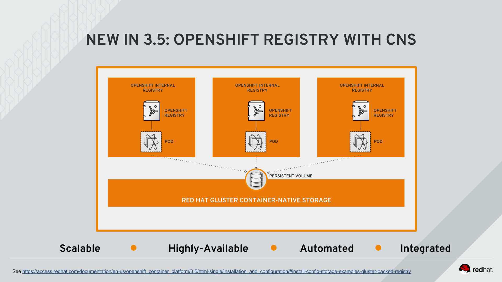
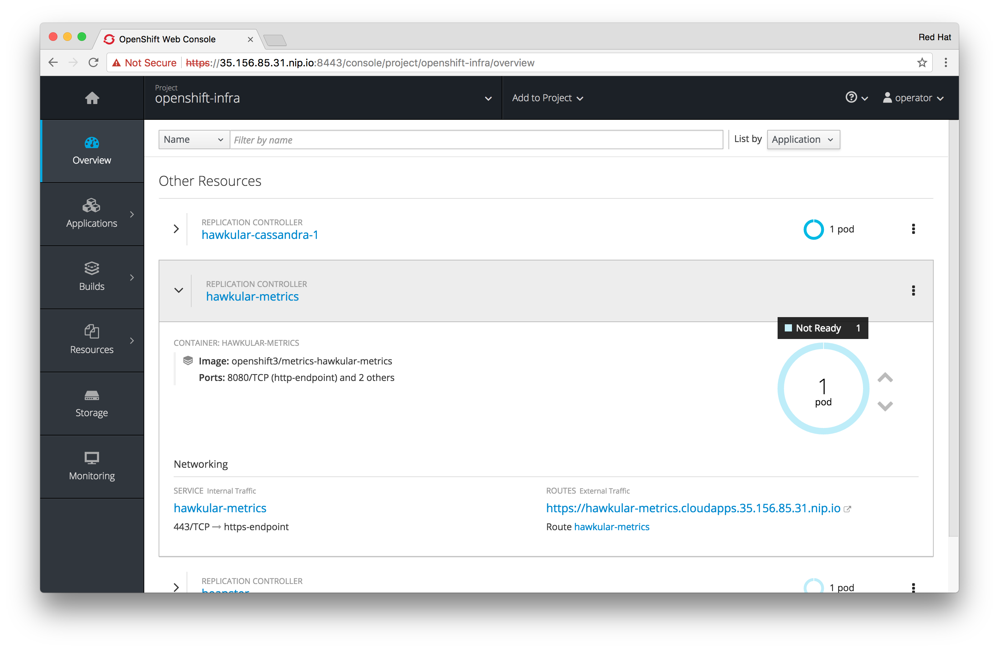
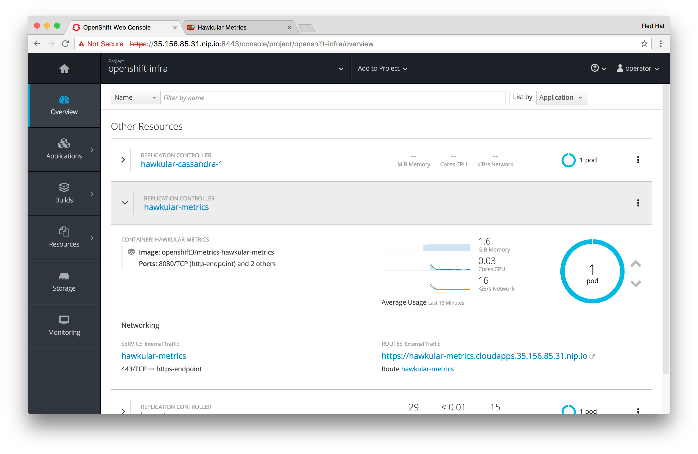
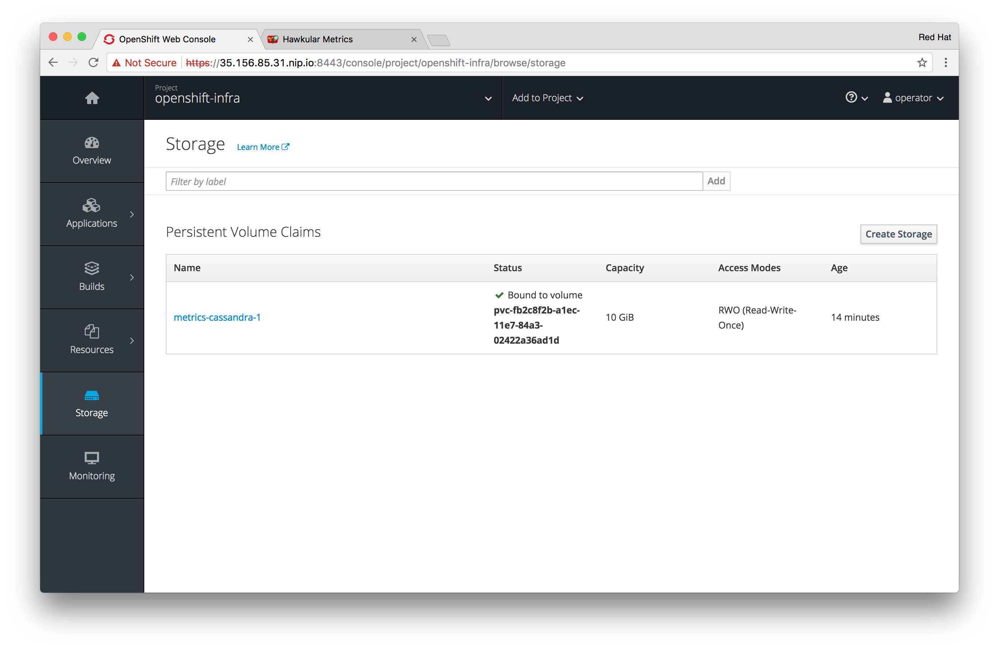
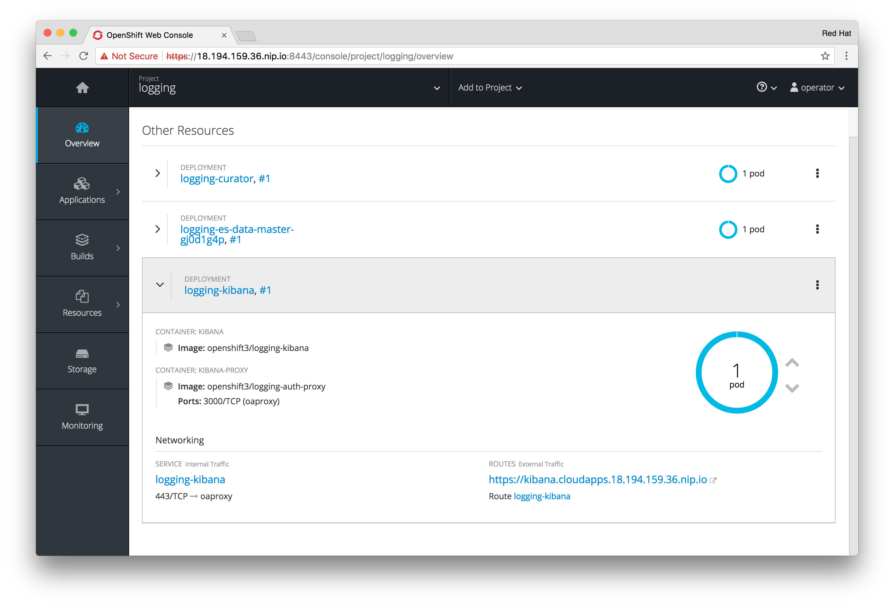
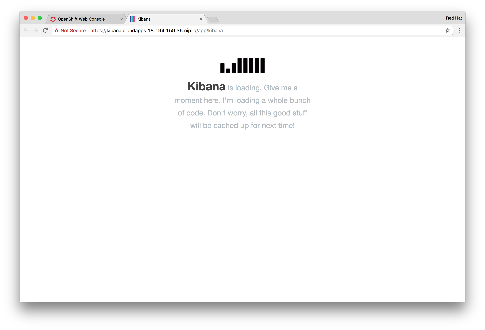
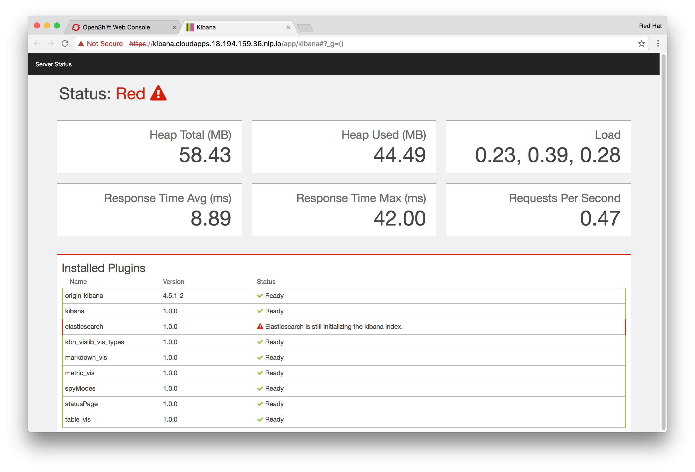

!!! Summary "Overview"
    In this module you will learn how to use Container-Native Storage to serve storage for OpenShift internal infrastructure.
    This module does not have any pre-requisites.

OpenShift Registry on CNS
-------------------------

The Registry in OpenShift is used to store all images that result of Source-to-Image deployments as well as custom container images.
It runs as one or more containers in specific Infrastructure Nodes or Master Nodes in OpenShift.

As explorerd in Module 1, by default the registry uses a hosts local storage (`emptyDir`) which makes it prone to outages. To avoid such outages the storage needs to be **persistent** and **shared** in order to survive Registry pod restarts and scale-out.

What we want to achieve is a setup like depicted in the following diagram:

This can be achieved with CNS simply by making the registry pods refer to a PVC in access mode *RWX* based on CNS.
Before OpenShift Container Platform 3.6 this had to be done manually on an existing CNS cluster.

With `openshift-ansible` you now have this setup task automated. The playbooks that implement this will deploy a **separate CNS cluster**, preferably on the *Infrastructure Nodes*, create a `PVC` and update the Registry `DeploymentConfig` to mount the associated `PV` which is where container images will then be stored.

!!! Caution "Important"
    This method will be disruptive. All data stored in the registry so far will become unavailable.
    Migration scenarios exist but are beyond the scope of this lab.

&#8680; Review the `openshift-ansible` inventory file in `/etc/ansible/ocp-with-glusterfs-registry` that has been prepared in your environment:

<kbd>/etc/ansible/ocp-with-glusterfs-registry:</kbd>
~~~~ini hl_lines="4 15 16 54 55 56 57"
[OSEv3:children]
masters
nodes
glusterfs_registry

[OSEv3:vars]
deployment_type=openshift-enterprise
containerized=true
openshift_image_tag=v3.6.173.0.21
openshift_master_identity_providers=[{'name': 'htpasswd', 'login': 'true', 'challenge': 'true', 'kind': 'HTPasswdPasswordIdentityProvider', 'filename': '/etc/origin/master/htpasswd'}]
openshift_master_htpasswd_users={'developer': '$apr1$bKWroIXS$/xjq07zVg9XtH6/VKuh6r/','operator': '$apr1$bKWroIXS$/xjq07zVg9XtH6/VKuh6r/'}
openshift_master_default_subdomain='cloudapps.52.59.170.248.nip.io'
openshift_router_selector='role=master'
openshift_registry_selector='role=infra'
openshift_hosted_registry_storage_kind=glusterfs
openshift_storage_glusterfs_registry_storageclass=true
openshift_metrics_install_metrics=false
openshift_metrics_hawkular_hostname="hawkular-metrics.{{ openshift_master_default_subdomain }}"
openshift_metrics_cassandra_storage_type=pv
openshift_metrics_cassandra_pvc_size=10Gi
openshift_hosted_logging_deploy=false
openshift_logging_es_pvc_size=10Gi
openshift_logging_es_pvc_dynamic=true
openshift_storage_glusterfs_image=rhgs3/rhgs-server-rhel7
openshift_storage_glusterfs_version=3.2.0-7
openshift_storage_glusterfs_heketi_image=rhgs3/rhgs-volmanager-rhel7
openshift_storage_glusterfs_heketi_version=3.2.0-11
openshift_storage_glusterfs_registry_namespace=infra-storage
openshift_docker_additional_registries=mirror.lab:5555
openshift_docker_insecure_registries=mirror.lab:5555
oreg_url=mirror.lab:5555/openshift3/ose-${component}:${version}
openshift_examples_modify_imagestreams=false
openshift_disable_check=disk_availability,memory_availability

[masters]
master.lab openshift_public_hostname=52.59.170.248.nip.io openshift_hostname=master.lab openshift_ip=10.0.1.100 openshift_public_ip=52.59.170.248

[masters:vars]
openshift_schedulable=true
openshift_node_labels="{'role': 'master'}"

[nodes]
master.lab openshift_public_hostname=52.59.170.248.nip.io openshift_hostname=master.lab openshift_ip=10.0.1.100 openshift_public_ip=52.59.170.248
infra-1.lab openshift_hostname=infra-1.lab openshift_ip=10.0.2.101 openshift_node_labels="{'role': 'infra'}"
infra-2.lab openshift_hostname=infra-2.lab openshift_ip=10.0.3.102 openshift_node_labels="{'role': 'infra'}"
infra-3.lab openshift_hostname=infra-3.lab openshift_ip=10.0.4.103 openshift_node_labels="{'role': 'infra'}"
node-1.lab openshift_hostname=node-1.lab openshift_ip=10.0.2.201 openshift_node_labels="{'role': 'app'}"
node-2.lab openshift_hostname=node-2.lab openshift_ip=10.0.3.202 openshift_node_labels="{'role': 'app'}"
node-3.lab openshift_hostname=node-3.lab openshift_ip=10.0.4.203 openshift_node_labels="{'role': 'app'}"
node-4.lab openshift_hostname=node-4.lab openshift_ip=10.0.2.204 openshift_node_labels="{'role': 'app'}"
node-5.lab openshift_hostname=node-5.lab openshift_ip=10.0.3.205 openshift_node_labels="{'role': 'app'}"
node-6.lab openshift_hostname=node-6.lab openshift_ip=10.0.4.206 openshift_node_labels="{'role': 'app'}"

[glusterfs_registry]
infra-1.lab glusterfs_ip=10.0.2.101 glusterfs_zone=1 glusterfs_devices='[ "/dev/xvdc" ]'
infra-2.lab glusterfs_ip=10.0.3.102 glusterfs_zone=2 glusterfs_devices='[ "/dev/xvdc" ]'
infra-3.lab glusterfs_ip=10.0.4.103 glusterfs_zone=3 glusterfs_devices='[ "/dev/xvdc" ]'
~~~~

The highlighted lines indicate the vital options in the inventory file to instruct `openshift-ansible` to deploy this setup.
Hosts in the `[glusterfs_registry]` group will run the CNS cluster specifically created for OpenShift Infrastructure. Just like in Module 2, each host gets specific information about the free block device to use for CNS and the failure zone it resides in (the infrastructure nodes are also hosted in 3 different Availability Zones)
The option `openshift_hosted_registry_storage_kind=glusterfs` will cause the registry to re-deployed with a `PVC` served by this cluster.

&#8680; First ensure that from an Ansible-perspective the required nodes are reachable

    ansible -i /etc/ansible/ocp-with-glusterfs-registry glusterfs_registry -m ping

All 3 OpenShift infrastructure nodes should respond:

~~~~
infra-3.lab | SUCCESS => {
    "changed": false,
    "ping": "pong"
}
infra-1.lab | SUCCESS => {
    "changed": false,
    "ping": "pong"
}
infra-2.lab | SUCCESS => {
    "changed": false,
    "ping": "pong"
}
~~~~

&#8680; Enable the Master to be schedulable:

    oadm manage-node master.lab --schedulable=true

!!! Important "Why does the master need to be schedulable?"
    This is a very simple lab environment :)
    There is no sophisticated external load-balancing across the infrastructure nodes in place.
    That's why the OpenShift router will run on the master node. The router will get re-deployed when executing the following playbook.
    So making the master accept pods again we ensure the re-deployed router finds it's place again.

&#8680; Run the CNS registry playbook that ships with `openshift-ansible`:

    ansible-playbook -i /etc/ansible/ocp-with-glusterfs-registry \
    /usr/share/ansible/openshift-ansible/playbooks/byo/openshift-glusterfs/registry.yml

&#8680; Disable scheduling on the Master again:

    oadm manage-node master.lab --schedulable=false

This will take about 6-7 minutes to complete.

!!! Important
    As in Module 2, executing the playbook in `byo/openshift-glusterfs/registry.yml` directly post-deployment is not supported in production as of yet. Special care has been taken in this lab so that it works here.
    This will change in one of the next releases of `openshift-ansible`.

The playbook should succeed without any failures. After it completes you have a Registry that uses CNS to store container images. It has automatically been scaled to 3 pods for high availability too.

&#8680; Log in as `operator` in the `default` namespace

    oc login -u operator -n default

&#8680; Verify a new version of the registry's `DeploymentConfig` is running:

    oc get deploymentconfig/docker-registry

It should say:

~~~
NAME              REVISION   DESIRED   CURRENT   TRIGGERED BY
docker-registry   2          1         1         config
~~~

&#8680; You can review the details and see how the `PVC` backs the registry by executing this command

    oc describe deploymentconfig/docker-registry

~~~~ hl_lines="36 37"
Name:		docker-registry
Namespace:	default
Created:	42 minutes ago
Labels:		docker-registry=default
Annotations:	<none>
Latest Version:	2
Selector:	docker-registry=default
Replicas:	3
Triggers:	Config
Strategy:	Rolling
Template:
Pod Template:
  Labels:		docker-registry=default
  Service Account:	registry
  Containers:
   registry:
    Image:	mirror.lab:5555/openshift3/ose-docker-registry:v3.6.173.0.21
    Port:	5000/TCP
    Requests:
      cpu:	100m
      memory:	256Mi
    Liveness:	http-get https://:5000/healthz delay=10s timeout=5s period=10s #success=1 #failure=3
    Readiness:	http-get https://:5000/healthz delay=0s timeout=5s period=10s #success=1 #failure=3
    Environment:
      REGISTRY_HTTP_ADDR:					:5000
      REGISTRY_HTTP_NET:					tcp
      REGISTRY_HTTP_SECRET:					4wwwdIkD5sKc/AcAQ76BuNaOWF13MvkYge6ltjJobn0=
      REGISTRY_MIDDLEWARE_REPOSITORY_OPENSHIFT_ENFORCEQUOTA:	false
      REGISTRY_HTTP_TLS_KEY:					/etc/secrets/registry.key
      REGISTRY_HTTP_TLS_CERTIFICATE:				/etc/secrets/registry.crt
    Mounts:
      /etc/secrets from registry-certificates (rw)
      /registry from registry-storage (rw)
  Volumes:
   registry-storage:
    Type:	PersistentVolumeClaim (a reference to a PersistentVolumeClaim in the same namespace)
    ClaimName:	registry-claim
    ReadOnly:	false
   registry-certificates:
    Type:	Secret (a volume populated by a Secret)
    SecretName:	registry-certificates
    Optional:	false

Deployment #2 (latest):
	Name:		docker-registry-2
	Created:	14 minutes ago
	Status:		Complete
	Replicas:	3 current / 3 desired
	Selector:	deployment=docker-registry-2,deploymentconfig=docker-registry,docker-registry=default
	Labels:		docker-registry=default,openshift.io/deployment-config.name=docker-registry
	Pods Status:	3 Running / 0 Waiting / 0 Succeeded / 0 Failed
Deployment #1:
	Created:	42 minutes ago
	Status:		Complete
	Replicas:	0 current / 0 desired

Events:
  FirstSeen	LastSeen	Count	From				SubObjectPath	Type		Reason				Message
  ---------	--------	-----	----				-------------	--------	------				-------
  42m		42m		1	deploymentconfig-controller			Normal		DeploymentCreated		Created new replication controller "docker-registry-1" for version 1
  14m		14m		1	deploymentconfig-controller			Normal		DeploymentCreated		Created new replication controller "docker-registry-2" for version 2
  14m		14m		1	deploymentconfig-controller			Normal		ReplicationControllerScaled	Scaled replication controller "docker-registry-1" from 842477907952 to 3
~~~~

While the exact output will be different for you it is easy to tell the registry pods are configured to mount a `PersistentVolume` associated with the `PersistentVolumeClaim` named `registry-claim`.

&#8680; Verify this `PVC` exists:

    oc get pvc/registry-claim

The `PVC` was automatically generated by `openshift-ansible`:

~~~~
NAME             STATUS    VOLUME            CAPACITY   ACCESSMODES   STORAGECLASS   AGE
registry-claim   Bound     registry-volume   5Gi        RWX                          23m
~~~~

`openshift-ansible` generated an independent set of GlusterFS pods, a separate instance of `heketi` and a separate `StorageClass` as well. These components were configured to use the `infra-storage` namespace. Refer to Module 2 to get an understanding of those components if you just skipped to here.

&#8680; Verify there are at least 3 GlusterFS pods and one `heketi` pod:

    oc get pods -n infra-storage

~~~~
NAME                       READY     STATUS    RESTARTS   AGE
glusterfs-registry-1jct8   1/1       Running   0          33m
glusterfs-registry-jp92q   1/1       Running   0          33m
glusterfs-registry-x2kkm   1/1       Running   0          33m
heketi-registry-1-k744l    1/1       Running   0          30m
~~~~

With this you have successfully remediated a single point of failure from your OpenShift installation. Since this setup is entirely automated by `openshift-ansible` you can deploy out of the box an OpenShift environment capable of hosting stateful applications and operate a fault-tolerant registry. All this with no external dependencies or complicated integration of external storage :)

---

OpenShift Logging/Metrics on CNS
--------------------------------

OpenShift Logging (Kibana) and Metrics (Cassandra) are also components that require persistent storage. Typically so far external block storage providers had to be used in order to get these services to work reliably.

It might seem counter-intuitive at first to consider CNS to serve these systems, mainly because:

  - Kibana and Cassandra are shared-nothing scale-out services
  - CNS provides shared filesystem storage whereas for Kibana/Cassandra a block storage device formatted with a local filesystem like XFS would be enough

Here are a couple of reasons why it is still a good idea to run those on CNS:

  - the total amount of storage available infra nodes is typically limited in capacity (CNS can scale beyond that)
  - the storage type available in infra nodes is most likely not suitable for performant long-term operations of these services (CNS uses aggregate performance of multiple devices and hosts)
  - without CNS some sort external storage system is required that requires additional manual configuration steps, in any case you should not use `emptyDir`

!!! Important
    In the next couple of steps we will deploy Logging/Metrics on CNS. This is will be supported with the upcoming release of CNS 3.6 (early October 2017) in production. However the instructions will slightly vary because the `PersistentVolumes` will not be backed by a normal GlusterFS volume but by `gluster-block` to achieve high performance.
    It will not be supported to run these services on standard `gluster-fuse` based CNS.

To review the required configuration sections in the `openshift-ansible` inventory file, open the standard inventory file `/etc/ansible/hosts/` that was used to deploy this OCP cluster initially:

<kbd>/etc/ansible/hosts:</kbd>
~~~~ini hl_lines="16 17 19 20"
[OSEv3:children]
masters
nodes

[OSEv3:vars]
deployment_type=openshift-enterprise
containerized=true
openshift_image_tag=v3.6.173.0.21
openshift_master_identity_providers=[{'name': 'htpasswd', 'login': 'true', 'challenge': 'true', 'kind': 'HTPasswdPasswordIdentityProvider', 'filename': '/etc/origin/master/htpasswd'}]
openshift_master_htpasswd_users={'developer': '$apr1$bKWroIXS$/xjq07zVg9XtH6/VKuh6r/','operator': '$apr1$bKWroIXS$/xjq07zVg9XtH6/VKuh6r/'}
openshift_master_default_subdomain='cloudapps.52.59.170.248.nip.io'
openshift_router_selector='role=master'
openshift_registry_selector='role=infra'
openshift_metrics_install_metrics=false
openshift_metrics_hawkular_hostname="hawkular-metrics.{{ openshift_master_default_subdomain }}"
openshift_metrics_cassandra_storage_type=pv
openshift_metrics_cassandra_pvc_size=10Gi
openshift_hosted_logging_deploy=false
openshift_logging_es_pvc_size=10Gi
openshift_logging_es_pvc_dynamic=true

[... output omitted... ]
~~~~

The highlighted lines indicate the settings that are required in order to put the Cassandra database of the OpenShift Metrics service on a `PersistentVolume` (`openshift_metrics_cassandra_storage_type=pv`) and how large this volume should be (`openshift_metrics_cassandra_pvc_size=10Gi`).
Similarly the backend for the ElasticSearch component of OpenShift Logging is set to `PersistentVolume` (`openshift_logging_es_pvc_dynamic=true`) and the size is specifed (`openshift_logging_es_pvc_size=10Gi`).
With these settings in place `openshift-ansible` will request `PVC` object for these services.

Unfortunately `openshift-ansible` today is lacking the ability to specify a certain `StorageClass` with those `PVCs`, so we have to make the CNS cluster that was created above temporarily the system-wide default.

&#8680; Login as `operator` to the `openshift-infra` namespace:

    oc login -u operator -n openshift-infra

&#8680; First, if you deployed the general-purpose CNS cluster in [Module 2](../module-2-deploy-cns/), you need to disable the other `StorageClass` `glusterfs-storage` from the other CNS stack as being the default:

    oc patch storageclass glusterfs-storage \
    -p '{"metadata": {"annotations": {"storageclass.kubernetes.io/is-default-class": "false"}}}'

&#8680; Then, use the `oc patch` command again to change the definition of the `StorageClass` on the fly:

    oc patch storageclass glusterfs-registry \
    -p '{"metadata": {"annotations": {"storageclass.kubernetes.io/is-default-class": "true"}}}'

&#8680; Verify that now the `StorageClass` `glusterfs-registry` is the default:

    oc get storageclass

~~~~ hl_lines="2"
NAME                           TYPE
glusterfs-registry (default)   kubernetes.io/glusterfs
glusterfs-storage              kubernetes.io/glusterfs
~~~~

#### Deploying OpenShift Metrics with Persistent Storage from CNS

The inventory file `/etc/ansible/hosts` as explained has all the required options set to run Logging/Metrics on dynamic provisioned storage supplied via a `PVC`. The only variable that we need to override is (`openshift_metrics_install_metrics`) to actually invoke the required playbooks the installation.

&#8680; Execute the Metrics deployment playbook like this:

    ansible-playbook -i /etc/ansible/hosts \
        -e openshift_metrics_install_metrics=True \
        /usr/share/ansible/openshift-ansible/playbooks/byo/openshift-cluster/openshift-metrics.yml

This takes about 1-2 minutes to complete. However the deployment is not quite finished yet.

&#8680; Use the `watch` command to wait for the `hawkular-metrics` pod to be in `READY` state.

    watch oc get pods -l name=hawkular-metrics

Exit out of the watch mode with: <kbd>Ctrl</kbd> + <kbd>c</kbd>

It will be ready when the database (Cassandra) finished initializing. Alternatively in the UI observe the deployment in the **Overview** pane, focussing on the `hawkular-metrics` deployment:

After 2-3 minutes all 3 pods, that make up the OpenShift Metrics service, should be ready:

&#8680; Verify all pods in the namespace have a `1/1` in the `READY` column:

    oc get pods

~~~~
NAME                         READY     STATUS    RESTARTS   AGE
hawkular-cassandra-1-sxctx   1/1       Running   0          5m
hawkular-metrics-895xz       1/1       Running   0          5m
heapster-pjxpp               1/1       Running   0          5m
~~~~

To use the Metrics service you need to logon / reload the OpenShift UI in your browser. You will then see a warning message like this one:

Don't worry - this is due to self-signed SSL certificates in this environment.

&#8680; Click the **Open Metrics URL** link and accept the self-signed certificate in your new browser tab. You will see the status page of the OpenShift Hawkular Metrics component:

&#8680; Then go back to the overview page. Next to the pods monitoring graphs for CPU, memory and network consumption will appear:

If you change to the **Storage** menu in the OpenShift UI you will also see the `PVC` that `openshift-ansible` has set up for the Cassandra pod.

Congratulations. You have successfully deploy OpenShift Metrics using scalable, fault-tolerant and persistent storage. The data that you see visualized in the UI is stored on a `PersistentVolume` served by CNS.

!!! Note "Preview"
    This was a preview of the general process. Note that this will be supported for production with the release of CNS 3.6.

#### Deploying OpenShift Logging with Persistent Storage from CNS

In a very similar fashion you can install OpenShift Logging Services, run by Kibana and ElasticSearch.

&#8680; As `operator`, login in to the `logging` namespace:

    oc login -u operator -n logging

&#8680; Execute the Logging deployment playbook like this:

    ansible-playbook -i /etc/ansible/hosts \
      -e openshift_hosted_logging_deploy=True \
      /usr/share/ansible/openshift-ansible/playbooks/byo/openshift-cluster/openshift-logging.yml

After 1-2 minutes the playbook finishes and you have a number of new pods in the `logging` namespace:

&#8680; List all the ElasticSearch pods that aggregate and store the logs:

    oc get pods -l component=es

This pod runs a single ElasticSearch instance.

~~~~
NAME                                      READY     STATUS    RESTARTS   AGE
logging-es-data-master-kcbtgll3-1-vb34h   1/1       Running   0          11m
~~~~

&#8680; List the Kibana pod:

    oc get pods -l component=kibana

This pod runs the Kibana front-end to query and search through logs:

~~~~
NAME                     READY     STATUS    RESTARTS   AGE
logging-kibana-1-1c2dj   2/2       Running   0          11m
~~~~

&#8680; List all Fluentd pods:

    oc get pods -l component=fluentd

These pods run as part of a `DaemonSet` and are responsible for collecting and shipping the various logs from all nodes to the ElasticSearch instance.

~~~~
NAME                    READY     STATUS    RESTARTS   AGE
logging-fluentd-3k7nh   1/1       Running   0          5m
logging-fluentd-473cf   1/1       Running   0          4m
logging-fluentd-9kgsv   1/1       Running   0          5m
logging-fluentd-h8fhb   1/1       Running   0          4m
logging-fluentd-pb6h8   1/1       Running   0          4m
logging-fluentd-q6lv4   1/1       Running   0          4m
logging-fluentd-r455n   1/1       Running   0          4m
logging-fluentd-v34ll   1/1       Running   0          5m
logging-fluentd-vxnd3   1/1       Running   0          5m
logging-fluentd-wf3lr   1/1       Running   0          5m
~~~~

Switch to the OpenShift UI and as `operator` select the `logging` project. In the **Overview** section you'll a `Route` for the Kibana deployment created. **Click** the link on the `Route` to open the Kibana UI in a new browser tab and verify the Kibana deployment is healthy.

The public URL for the Kibana UI will be visible in the **ROUTES** section of the `logging-kibana` deployment.

When you are logging on for the first time Kibana will ask for credentials.
Use your OpenShift `operator` account with the password `r3dh4t`.

After logging in you will see that Kibana has started indexing the database, which is hosted on CNS by ElasticSearch.

This shows that ElasticSearch search running of CNS-provided `PersistentVolume` successfully. It will take some time to complete the first indexing.
